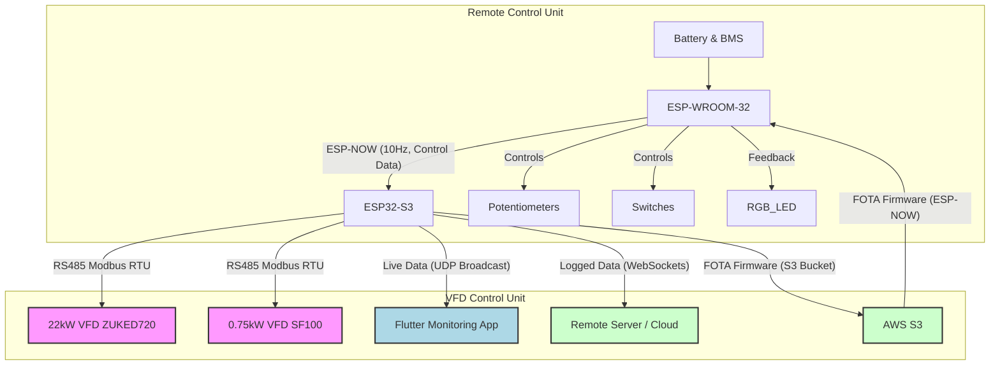

# ESP32-VFD-Remote-Control-Monitoring

## 🚀 Project Overview

Welcome to the **ESP32 Industrial VFD Remote Control & Telemetry System**! This project demonstrates a robust, wireless solution for controlling and monitoring a high-power diamond wire cutting machine, leveraging modern IoT and embedded systems technologies.

It serves as a professional portfolio piece, showcasing expertise in embedded C++, IoT protocols (ESP-NOW, Modbus RTU, UDP, WebSockets), real-time data handling, and cross-platform mobile development (Flutter).

---

## ✨ Key Features

This system is designed around three interconnected modules:

1.  **Wireless Remote Control Unit:**
    * Ergonomic, battery-powered handheld remote.
    * Intuitive physical controls for motor speed (potentiometers) and direction (3-position switches).
    * Master power control for safety.
    * RGB LED for real-time status and comprehensive error indication (low battery, communication issues).
    * Low-power design for extended battery life.
    * Over-The-Air (OTA) firmware update capability via ESP-NOW.

2.  **VFD Control & Telemetry Unit (Machine-Side):**
    * **Dual VFD Control:** Seamlessly manages two Variable Frequency Drives (a 22kW and a 0.75kW motor).
    * **RS485 Modbus RTU:** Robust communication with industrial VFDs for precise speed/direction control and comprehensive data acquisition.
    * **Real-time Telemetry:** Reads live voltage, current, frequency, torque, power, and temperature from VFDs.
    * **Error Monitoring:** Acquires VFD fault codes and status.
    * **Local Monitoring (AP Mode):** Acts as a Wi-Fi Access Point, broadcasting live VFD data via UDP, allowing any mobile device to connect and monitor.
    * **Remote Data Logging:** Stores critical operational data (binary format) locally.
    * **Cloud Integration:** Securely transmits logged data to a remote server via WebSockets for long-term analysis and remote access.
    * **Advanced FOTA:** Manages firmware updates for *both* itself and the Remote Control Unit by fetching binaries from an S3 bucket and distributing them.

3.  **Mobile Monitoring Application (Flutter):**
    * Cross-platform (iOS/Android) application developed with Flutter.
    * Connects to the VFD Control Unit's local Wi-Fi AP.
    * Provides a clean, real-time dashboard displaying all acquired VFD parameters.
    * Visualizes motor status, operating conditions, and error messages.

---

## 🛠️ Technologies Used

| Category         | Technologies / Protocols                                  |
| :--------------- | :-------------------------------------------------------- |
| **Microcontrollers** | ESP-WROOM-32, ESP32-S3                                    |
| **Firmware** | C++ (ESP-IDF)                         |
| **Communication**| ESP-NOW, RS485 (Modbus RTU), UDP, WebSockets              |
| **Mobile App** | Flutter (Dart)                                            |
| **Cloud** | AWS S3 (for FOTA firmware hosting), Custom WebSocket Server (Conceptual) |
| **Tools** | ESP-IDF, Git, GitHub                                   |

---

## 🧩 System Architecture

The system is designed with a clear separation of concerns, ensuring modularity, scalability, and robust performance.

